# OpenADMET + ExpansionRx Blind Challenge

- **Authors**: Alec Glisman, PhD
- **Date**: December 2025

---

> 📋 **For Challenge Reviewers:** See the **[Model Card](./MODEL_CARD.md)** for complete methodology documentation, including model architecture, training procedures, HPO results, and performance metrics.
>
> 📋 **For Others:** See the **[Submission History Statistics](./SUBMISSIONS.md)** for detailed leaderboard rankings and performance summaries.

---

## Table of Contents

**Getting Started**

- [Installation](#getting-started)
- [Quick Overview](#quick-overview)
- [CLI Quick Reference](#cli-quick-reference)

**Core Concepts**

- [Predicted Endpoints](#predicted-endpoints)
- [Models](#models)
- [Training Strategy](#training-strategy)

**Usage Guide**

- [Data Preparation](#data-preparation)
- [Model Training](#model-training)
- [Evaluation & Analysis](#evaluation--analysis)

**Advanced Topics**

- [Hyperparameter Optimization](#hyperparameter-optimization-hpo)
- [Ensemble Training](#ensemble-training)
- [Task Affinity Grouping](#task-affinity-grouping)

**Reference**

- [Development Tools](#development-tools)
- [Approach Summary](#approach-summary)
- [Links](#links)

## Getting Started

This repository contains code and documentation for participating in the OpenADMET + ExpansionRx Blind Challenge. The goal of this challenge is to develop machine learning models to predict various ADMET properties of small molecules using the provided dataset.

To get started, please follow the installation instructions in [INSTALLATION.md](./INSTALLATION.md) to set up your development environment.
You can find contribution guidelines in [CONTRIBUTING.md](./CONTRIBUTING.md) if you wish to contribute to this project.

## Quick Overview

**ADMET CLI Architecture:**


**End-to-End Pipeline:**


| Component | Configuration |
| ----------- | --------------- |
| **Architecture** | Chemprop MPNN (v2.2.1) |
| **Ensemble** | 5 × 5 CV folds |
| **HPO** | ~2,000 Ray Tune ASHA trials |
| **Convergence** | 60–120 epochs (early stopping on val MAE) |
| **Best Val MAE** | 0.4–0.6 (macro-averaged) |

## CLI Quick Reference

| Command | Purpose | Example |
|---------|---------|--------|
| `admet data split` | Generate train/val splits | `admet data split data.csv --cluster-method bitbirch` |
| `admet model train` | Train single model | `admet model train -c configs/0-experiment/chemprop.yaml` |
| `admet model ensemble` | Train ensemble | `admet model ensemble -c configs/3-production/ensemble.yaml` |
| `admet model hpo` | Hyperparameter search | `admet model hpo -c configs/1-hpo-single/hpo_chemprop.yaml --num-samples 50` |
| `admet model list` | List available models | `admet model list` |
| `admet leaderboard scrape` | Download leaderboard | `admet leaderboard scrape --user username` |
| `admet leaderboard report` | Generate report | `admet leaderboard report assets/submissions/latest/data --user username` |

**Full documentation:** See [INSTALLATION.md](./INSTALLATION.md) for setup and [docs/guide/cli.rst](./docs/guide/cli.rst) for detailed CLI usage.

### Predicted Endpoints

| Endpoint | Description | Data Coverage |
| ---------- | ------------- | --------------- |
| LogD | Lipophilicity | ★★★ High |
| KSOL | Kinetic Solubility (μM) | ★★★ High |
| HLM CLint | Human Liver Microsomal Clearance | ★★★ High |
| MLM CLint | Mouse Liver Microsomal Clearance | ★★★ High |
| Caco-2 Papp | Permeability (A→B) | ★★☆ Medium |
| Caco-2 Efflux | Efflux Ratio | ★★☆ Medium |
| MPPB | Mouse Plasma Protein Binding | ★★☆ Medium |
| MBPB | Mouse Brain Protein Binding | ★☆☆ Sparse |
| MGMB | Mouse Gut Microbiome Binding | ★☆☆ Sparse |

---

## Models

### Implemented

#### Encoder

| Model | Architecture | Status |
| ------- | -------------- | -------- |
| **Chemprop MPNN** | Message-passing neural network | Primary model |

#### Decoder

| Model | Architecture | Status |
| ------- | -------------- | -------- |
| **MLP FFN** | Standard feed-forward | Best performing |
| **MoE FFN** | Mixture of Experts | Evaluated (competitive) |
| **Branched FFN** | Task-specific branches | Evaluated (competitive) |

### Planned

| Model | Architecture | Status |
| ------- | -------------- | -------- |
| XGBoost | Gradient boosting | Future |
| LightGBM | Gradient boosting | Future |
| CheMeleon | Pretrained MPNN | Future |
| ChemBERTa-3 | Transformer | Future |

## Training Strategy

- **Ensemble:** 5 Butina splits × 5 CV folds = 25 models
- **HPO:** Ray Tune with ASHA scheduler (~2,000 trials)
- **Early Stopping:** 15 epochs patience on validation MAE
- **Joint Sampling:** Unified two-stage sampling combining:
  - **Task Oversampling:** α-weighted inverse-power sampling for sparse endpoints (α ∈ [0,1])
  - **Curriculum Learning:** Progressive quality-based inclusion (warmup → expand → robust → polish)
  - Count-normalized sampling ensures target proportions regardless of dataset size imbalance
- **Task Affinity Grouping:** Automatic grouping of related endpoints for joint training

**Challenge Evaluation:** MA-RAE (Macro-Averaged Relative Absolute Error) ranking with per-endpoint MAE. See [Challenge Hugging Face Page](https://huggingface.co/spaces/openadmet/OpenADMET-ExpansionRx-Challenge) for full criteria.

[↑ Back to top](#openadmet--expansionrx-blind-challenge)

---

## Usage

This section covers all aspects of using this repository, from data preparation through model training to evaluation and development tools.

---

### Data Preparation

#### Datasets

We will attempt to augment the provided training dataset with additional publicly available ADMET datasets to improve model performance. Potential sources for augmentation are listed in the [Links](#links) section below.

#### Data Splitting

```mermaid
flowchart TB
    subgraph Input["Input Data"]
        CSV["Raw Dataset<br/>(SMILES + Targets)"]
    end

    subgraph QualityFilter["Quality Filtering"]
        CSV --> QF{Quality<br/>Filter}
        QF -->|high| QH["High Quality"]
        QF -->|high,medium| QM["High + Medium"]
        QF -->|all| QA["All Data"]
    end

    subgraph Clustering["Molecular Clustering"]
        QH & QM & QA --> ClusterMethod{"<b>cluster_data()</b><br/>Clustering Method"}
        ClusterMethod -->|bitbirch| BB["<b>BitBirch</b><br/>diameter_prune_tolerance_reassign()"]
        ClusterMethod -->|butina| BT["<b>Butina</b><br/>Taylor-Butina clustering"]
        ClusterMethod -->|scaffold| SC["<b>Scaffold</b><br/>Bemis-Murcko"]
        ClusterMethod -->|kmeans| KM["<b>K-Means</b><br/>Fingerprint-based"]
        ClusterMethod -->|umap| UM["<b>UMAP</b><br/>Dimensionality reduction"]
        ClusterMethod -->|random| RD["<b>Random</b><br/>Baseline"]
    end

    subgraph Splitting["Cross-Validation Strategy"]
        BB & BT & SC & KM & UM & RD --> Labels["<b>build_cluster_label_matrix()</b><br/>Task Coverage + Quality + Size"]
        Labels --> SplitMethod{"<b>cluster_kfold()</b><br/>Split Method"}
        SplitMethod -->|multilabel_stratified_kfold| MS["<b>MultilabelStratifiedKFold</b><br/>Balance task coverage<br/>+ quality tiers"]
        SplitMethod -->|stratified_kfold| SK["<b>StratifiedKFold</b><br/>Balance quality only"]
        SplitMethod -->|group_kfold| GK["<b>GroupKFold</b><br/>Cluster integrity only"]
    end

    subgraph Output["Output Structure"]
        MS & SK & GK --> Folds["<b>pipeline()</b><br/>5 Splits × 5 Folds<br/>= 25 Train/Val Sets"]
        Folds --> DirStruct["split_N/fold_M/<br/>├── train.csv<br/>├── validation.csv<br/>└── metadata.json"]
    end

    subgraph Diagnostics["Optional Diagnostics"]
        Folds -.->|diagnostics=True| Diag["<b>ClusterCVDiagnostics</b>"]
        Diag -.-> Plots["Cluster size histograms<br/>Fold balance boxplots<br/>Task coverage heatmaps"]
    end

    style Input fill:#e1f5ff,stroke:#01579b,stroke-width:2px
    style QualityFilter fill:#e3f2fd,stroke:#1565c0,stroke-width:2px
    style Clustering fill:#e8f5e9,stroke:#2e7d32,stroke-width:2px
    style Splitting fill:#fff3e0,stroke:#e65100,stroke-width:2px
    style Output fill:#f3e5f5,stroke:#6a1b9a,stroke-width:2px
    style Diagnostics fill:#fce4ec,stroke:#c2185b,stroke-width:2px,stroke-dasharray: 5 5
```



> **Note on Quality Assignment:** Quality labels are assigned heuristically. All challenge dataset entries are labeled as "high" quality. For augmentation datasets, quality is assigned per-task, per-dataset based on endpoint overlap and assay experimental similarity.

**Generate splits using CLI or Python:**

```bash
# CLI: Basic usage
admet data split data.csv --cluster-method bitbirch --split-method multilabel_stratified_kfold

# Python: Programmatic access
from admet.data.split import pipeline
df_with_assignments = pipeline(df, cluster_method="bitbirch", n_splits=5, n_folds=5)
```

**Splitting methods:**

- **Clustering:** `bitbirch` (recommended), `butina`, `scaffold`, `kmeans`, `umap`, `random`
- **Stratification:** `multilabel_stratified_kfold`, `stratified_kfold`, `group_kfold`

**See:** [scripts/data/](./scripts/data/) for batch processing examples

---

## Evaluation & Analysis

### Leaderboard Reports

Scrape leaderboard data and generate analysis reports:

```bash
admet leaderboard scrape --user username      # Download submissions
admet leaderboard report <data-dir> --user username  # Generate report
```

**Output:** `assets/submissions/<date>/` contains `report.md`, `summary.txt`, `data/*.csv`, and `figures/`

**Full documentation:** See [docs/guide/cli.rst](./docs/guide/cli.rst)

---

### Model Training


### Single Model Training

Train individual models using YAML configs:

```bash
admet model train -c configs/0-experiment/chemprop.yaml
```

**Config examples:** See [configs/0-experiment/](./configs/0-experiment/) for templates

#### Ensemble Training


Train ensembles across multiple splits/folds with Ray parallelization:

```bash
admet model ensemble -c configs/3-production/ensemble.yaml --max-parallel 4
```

**Ensemble config:** Extends single-model config with `data_dir` (pointing to `split_*/fold_*/` structure) and resource limits. See [configs/3-production/](./configs/3-production/) for examples.

#### Hyperparameter Optimization (HPO)


## Task Affinity Grouping

Automatically discover related tasks for joint training:

```bash
admet model train -c configs/task-affinity/chemprop.yaml
```

**Config:** Set `task_affinity.enabled: true` and `task_affinity.n_groups: 3`. See [configs/task-affinity/](./configs/task-affinity/) and [docs/guide/task_affinity.rst](./docs/guide/task_affinity.rst)


Task affinity automatically groups related tasks (e.g., solubility, permeability, metabolism) to improve multi-task learning. See [docs/guide/task_affinity.rst](./docs/guide/task_affinity.rst) for detailed usage.

## Hyperparameter Optimization (HPO)

Run distributed HPO with Ray Tune + ASHA:

```bash
admet model hpo -c configs/1-hpo-single/hpo_chemprop.yaml --num-samples 100
```

**Features:** ASHA early stopping, conditional search spaces (FFN type, MoE experts), MLflow tracking

**Output:** `hpo_results/top_k_configs.json` (best configs) and `ray_results/` (full trial history)

**See:** [configs/1-hpo-single/](./configs/1-hpo-single/) for search space definitions

---

### Model Documentation

📋 **Complete methodology:** See **[MODEL_CARD.md](./MODEL_CARD.md)** for architecture details, HPO results, ensemble strategy, data sources, and known limitations.

📊 **Submission history:** See **[SUBMISSIONS.md](./SUBMISSIONS.md)** for leaderboard rankings and performance summaries.

## Development Tools

**Tech Stack:** Python 3.11, Chemprop (MPNN), PyTorch, Ray Tune (HPO), MLflow (tracking), RDKit (cheminformatics), Typer/Rich (CLI)

**Quality Control:** Pre-commit hooks enforce Black/isort formatting, flake8/pylint/mypy linting, pytest tests, and Commitizen commit messages. See [CONTRIBUTING.md](./CONTRIBUTING.md)

**Documentation:** Build with `make -C docs html` or `sphinx-autobuild docs docs/_build/html` for live preview

---

## Approach Summary

```mermaid
flowchart TB
    subgraph DataSources["Data Sources"]
        Primary["<b>Primary:</b> ExpansionRx<br/>Challenge Dataset"]
        Aug1["<b>Augmentation:</b><br/>KERMT, PharmaBench<br/>TDC, Polaris ADME"]
    end

    subgraph DataPrep["Data Preparation Pipeline"]
        Primary & Aug1 --> Merge["<b>Data Integration</b><br/>Merge + Deduplicate<br/>Quality scoring"]
        Merge --> Clustering["<b>BitBirch Clustering</b><br/>Molecular fingerprints<br/>diameter_prune_tolerance_reassign()"]
        Clustering --> Stratification["<b>Multilabel Stratified K-Fold</b><br/>Balance: Task coverage<br/>+ Quality tiers + Cluster size"]
        Stratification --> Splits["<b>5 Splits × 5 Folds</b><br/>= 25 Train/Val sets<br/>Cluster integrity preserved"]
    end

    subgraph HPO["Hyperparameter Optimization"]
        Splits --> OneFold["<b>Use Split 0, Fold 0</b><br/>for HPO efficiency"]
        OneFold --> RayTune["<b>Ray Tune + ASHA</b><br/>~2000 trials<br/>Early stopping"]
        RayTune --> SearchSpace["<b>Conditional Search Space</b><br/>MPNN: 3-7 layers<br/>FFN: MLP/MoE/Branched<br/>Task Affinity: 2-5 groups<br/>LR: 1e-5 to 1e-3"]
        SearchSpace --> TopConfigs["<b>Top 10 Configurations</b><br/>Ranked by Val MAE<br/>Saved to JSON"]
    end

    subgraph Ensemble["Ensemble Training"]
        TopConfigs --> BestConfig["<b>Select Best Config</b><br/>from HPO results"]
        BestConfig --> AllSplits["<b>Train on all 25 folds</b><br/>Split 0-4, Fold 0-4"]
        AllSplits --> RayParallel["<b>Ray Parallelization</b><br/>max_parallel models<br/>Resource management"]
        RayParallel --> Model1["Model 1<br/>Split 0, Fold 0"]
        RayParallel --> Model2["Model 2<br/>Split 0, Fold 1"]
        RayParallel --> ModelN["Model 25<br/>Split 4, Fold 4"]
        Model1 & Model2 & ModelN --> Checkpoints["<b>25 Trained Models</b><br/>Individual checkpoints<br/>+ metrics"]
    end

    subgraph Advanced["Advanced Features"]
        AllSplits -.->|optional| TaskAff["<b>Task Affinity Grouping</b><br/>Gradient-based clustering<br/>Multi-head architecture"]
        AllSplits -.->|optional| JointSample["<b>JointSampler</b><br/>Two-stage sampling:<br/>1. Task selection (α-weighted)<br/>2. Curriculum weighting"]
    end

    subgraph Prediction["Ensemble Prediction"]
        Checkpoints --> BlindTest["<b>Blind Test Set</b><br/>SMILES only<br/>No labels"]
        BlindTest --> Individual["<b>25 Individual Predictions</b><br/>Per molecule, per endpoint"]
        Individual --> Aggregate["<b>Aggregation Strategy</b>"]
        Aggregate --> Mean["<b>Mean Prediction</b><br/>Ensemble consensus"]
        Aggregate --> StdDev["<b>Std Deviation</b><br/>Epistemic uncertainty<br/>Model disagreement"]
    end

    subgraph Evaluation["Comprehensive Evaluation"]
        Mean --> LocalTest["<b>Local Test Set</b><br/>Held-out with labels<br/>For validation"]
        LocalTest --> Metrics["<b>7 Metrics</b>"]
        Metrics --> MAE["MAE: Primary metric"]
        Metrics --> RMSE["RMSE: Error magnitude"]
        Metrics --> RAE["RAE: Relative error"]
        Metrics --> R2["R²: Explained variance"]
        Metrics --> Pearson["Pearson r²: Linear corr"]
        Metrics --> Spearman["Spearman ρ²: Rank corr"]
        Metrics --> Kendall["Kendall τ: Ordinal assoc"]
    end

    subgraph Submission["Leaderboard Submission"]
        Mean --> Format["<b>Format Predictions</b><br/>Molecule Name + 9 endpoints"]
        StdDev --> Uncertainty["<b>Uncertainty Estimates</b><br/>Confidence intervals"]
        Format --> Submit["<b>Submit to OpenADMET</b><br/>Daily submission limit<br/>Latest = final score"]
        Submit --> Leaderboard["<b>Challenge Leaderboard</b><br/>MA-RAE ranking<br/>Per-endpoint MAE"]
    end

    subgraph Tracking["Experiment Management"]
        MLflow --> Artifacts["Artifacts<br/>Checkpoints, plots, configs"]
        MLflow --> Comparison["Compare experiments<br/>Track improvements"]
    end

    style DataSources fill:#e1f5ff,stroke:#01579b,stroke-width:2px
    style DataPrep fill:#e3f2fd,stroke:#1565c0,stroke-width:2px
    style HPO fill:#fff3e0,stroke:#e65100,stroke-width:2px
    style Ensemble fill:#e8f5e9,stroke:#2e7d32,stroke-width:2px
    style Advanced fill:#fce4ec,stroke:#c2185b,stroke-width:2px,stroke-dasharray: 5 5
    style Prediction fill:#f3e5f5,stroke:#6a1b9a,stroke-width:2px
    style Evaluation fill:#e0f2f1,stroke:#00695c,stroke-width:2px
    style Submission fill:#fff9c4,stroke:#f57f17,stroke-width:2px
    style Tracking fill:#f9fbe7,stroke:#827717,stroke-width:2px
```



---

## Links

### Challenge Information

- [Challenge Hugging Face Page](https://huggingface.co/spaces/openadmet/OpenADMET-ExpansionRx-Challenge)
- [Teaser Dataset on Hugging Face](https://huggingface.co/datasets/openadmet/openadmet-expansionrx-challenge-teaser)

    ```python
    # Hugging Face Datasets library
    from datasets import load_dataset
    ds = load_dataset("openadmet/openadmet-expansionrx-challenge-teaser")
    ```

- [Full Dataset on Hugging Face (not live)](https://huggingface.co/datasets/openadmet/openadmet-challenge-train-data)

### Reference Models

- [XGBoost Baseline](https://xgboost.readthedocs.io/en/stable/python/sklearn_estimator.html)
- [Chemprop Multitask](https://chemprop.readthedocs.io/en/latest/multi_task.html)
- [Chemprop Pretrained](https://chemprop.readthedocs.io/en/latest/chemeleon_foundation_finetuning.html)
- [ChemBERTa Foundation](https://deepchem.io/tutorials/transfer-learning-with-chemberta-transformers/)
- [KERMT Pretrained](https://github.com/NVIDIA-Digital-Bio/KERMT)

### External Datasets

- [x] [KERMT](https://figshare.com/articles/dataset/Datasets_for_Multitask_finetuning_and_acceleration_of_chemical_pretrained_models_for_small_molecule_drug_property_prediction_/30350548/2)
- [x] [Polaris Antiviral](https://polarishub.io/datasets/asap-discovery/antiviral-admet-2025-unblinded)
- [x] [Polaris ADME Fang](https://polarishub.io/datasets/biogen/adme-fang-v1)
- [x] [TDC](https://tdcommons.ai/benchmark/admet_group/overview/)
- [x] [PharmaBench](https://github.com/mindrank-ai/PharmaBench)
- [x] [NCATS](https://opendata.ncats.nih.gov/adme/data)
- [ ] [admetSAR 3.0](https://pmc.ncbi.nlm.nih.gov/articles/PMC11223829/#:~:text=Data%20collection,are%20available%20in%20Text%20S2.)
  - NOTE: Appears to be proprietary data
- [x] [admetica](https://github.com/datagrok-ai/admetica)
- [x] [ChEMBL ADMET](https://ftp.ebi.ac.uk/pub/databases/chembl/ChEMBLdb/latest)

### Papers and Blogs

- [Dataset Splitting](https://practicalcheminformatics.blogspot.com/2024/11/some-thoughts-on-splitting-chemical.html)
- [Benchmarking](https://practicalcheminformatics.blogspot.com/2023/08/we-need-better-benchmarks-for-machine.html)
- [Comparisons](https://practicalcheminformatics.blogspot.com/2025/03/even-more-thoughts-on-ml-method.html)
- [Practically Significant Method Comparison Protocols for Machine Learning in Small Molecule Drug Discovery](https://pubs.acs.org/doi/full/10.1021/acs.jcim.5c01609)

### Examples

- [DataBricks Chemprop Training](https://community.databricks.com/t5/technical-blog/ai-drug-discovery-made-easy-your-complete-guide-to-chemprop-on/ba-p/111750#h_324287967181751055572426)
- [Chemprop Data Splitting](https://chemprop.readthedocs.io/en/latest/tutorial/python/data/splitting.html)
- [Chemprop Multitask Model](https://chemprop.readthedocs.io/en/latest/multi_task.html)
- [CheMeleon Foundation Finetuning](https://chemprop.readthedocs.io/en/latest/chemeleon_foundation_finetuning.html)

### Coding Assistants

- [Copilot Prompts](https://github.com/github/awesome-copilot/tree/main?tab=readme-ov-file)
